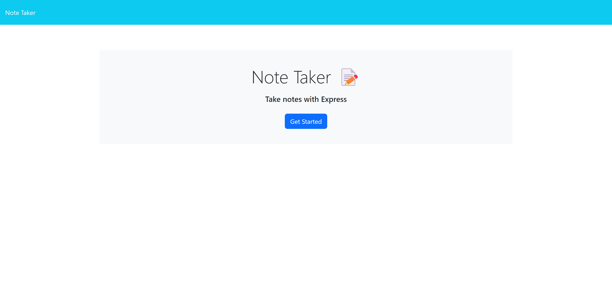

# Note Taker

## Description

This web application allows a user to create and save a list of notes for various uses. After a note is saved, it appears in a list on the left side of the screen that a user can then click on to view its details/description.

## Table of Contents

* [Installation](#installation)

* [Usage](#usage)

* [License](#license)

* [Contributing](#contributing)

* [Tests](#tests)

* [Credits](#credits)

* [Questions](#questions)

## Installation

To install necessary dependencies, run the following command:

```bash
npm i
```

## Usage

Follow [this](https://vast-earth-11586-4135a42128b0.herokuapp.com/) link to open the web application. 



After clicking the blue "Get Started" button, you will be taken to a screen where you will be able to create a note and save it by clicking on the save button that appears in the top right of the screen. 


The note should then be saved in the list on the left side.

## License

N/A

## Contributing

Feel free to contribute!

## Tests

To run tests, run the following command:

```bash
npm test
```

## Credits

N/A

## Questions

If you have any questions about the repo, open an issue or contact me directly at jbriseno2000@gmail.com. You can find more of my work at [jb6131](https://github.com/jb6131/).
